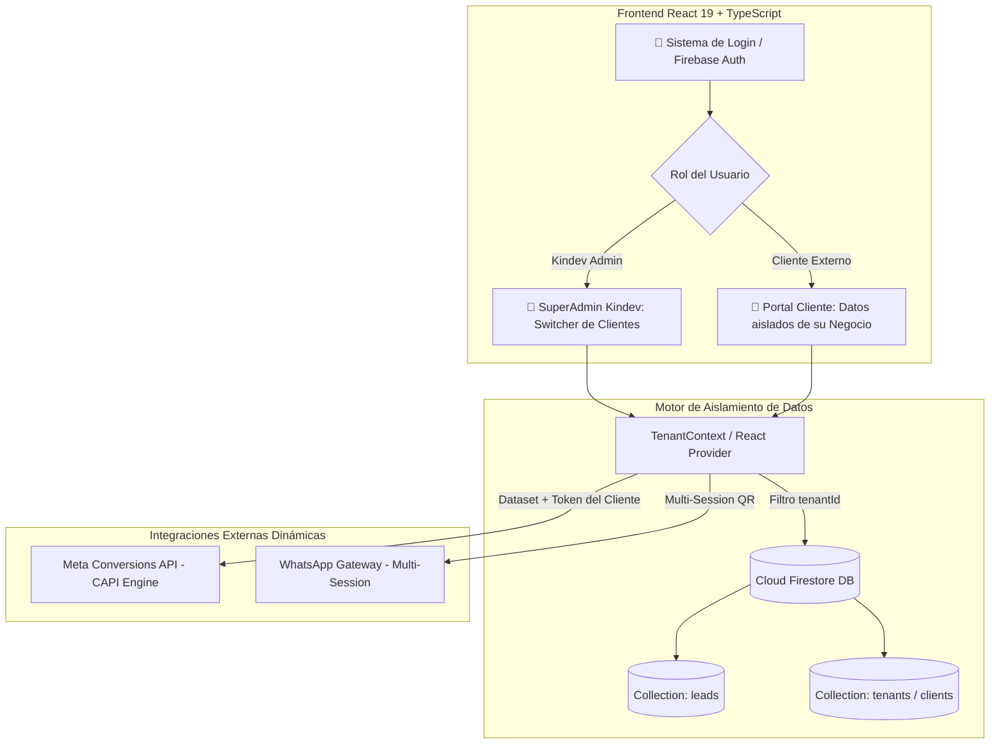

# 📘 Arquitectura Multi-Cliente y Requisitos de Conexión
**Kindev Meta Ads Engine — Sistema Multi-Tenant SaaS & Gestión de Clientes (2026)**

---

## 🎯 1. Resumen Ejecutivo y Viabilidad Técnica

### ¿Es viable convertir Kindev Meta Ads en una plataforma multi-cliente?
**Sí, es 100% viable.** La infraestructura actual (React 19 + TypeScript en frontend, Cloud Firestore como base de datos en tiempo real, Baileys para WhatsApp y Meta Graph API v19.0+ para CAPI) posee un diseño desacoplado que permite escalar hacia un modelo **Multi-Tenant (SaaS / Panel de Agencia)** sin reescribir el software desde cero.

### 🛡️ Regla de Oro: Blindaje Total de Kindev (Zero-Downtime / Zero-Disruption)
La cuenta actual de Kindev, su Dataset ID (`1368429478371391`), su bot de WhatsApp activo (`auth_baileys/`) y su historial de leads en Firestore **permanecen 100% operativos e intactos**:
* Todo registro preexistente sin identificador de tenant se asigna automáticamente al `tenantId: 'kindev'`.
* El servidor preserva la sesión de Kindev como sesión primaria/maestra.
* Las credenciales por defecto siguen respaldadas en variables de entorno y `localStorage`.

---

## 🏗️ 2. Arquitectura del Sistema Multi-Cliente



### Componentes Clave:
1. **Autenticación y Roles:**
   - **SuperAdmin (Kindev):** Tiene acceso a todos los clientes mediante un selector desplegable (*Client Switcher*), métricas globales y configuración maestra.
   - **ClientAdmin (Cliente X):** Solo puede ver y gestionar sus propios leads, sus ventas cerradas, su estado de WhatsApp y las métricas de su campaña.

2. **Estructura de Base de Datos en Firestore:**
   - Colección `tenants`:
     ```typescript
     interface Tenant {
       id: string; // ej. 'kindev', 'cliente_dr_mendez', 'inmobiliaria_valle'
       name: string;
       contactPhone: string;
       plan: 'basic' | 'pro' | 'enterprise';
       metaConfig: {
         datasetId: string;
         accessToken: string; // Cifrado o privado
         testMode: boolean;
         testEventCode: string;
         adAccountId?: string;
       };
       whatsappConfig: {
         status: 'connected' | 'qr_ready' | 'disconnected';
         connectedUser?: string;
         keywords: string[];
       };
       createdAt: string;
     }
     ```
   - Modificación en `leads`:
     Se agrega el campo `tenantId: string`. Si un lead no posee `tenantId`, el sistema asume `tenantId: 'kindev'`.

3. **Multi-Sesión de WhatsApp (Baileys en `server.js`):**
   - Actualmente: `auth_baileys/` único.
   - Nuevo esquema: `auth_baileys/{tenantId}/`. El servidor Express gestiona un mapa de sockets en memoria (`const sessions = new Map<string, WASocket>()`).
   - Ruta visual para vincular WhatsApp: `/qr?tenant=cliente_xyz`.

4. **Despacho Dinámico de CAPI (`meta-capi.ts`):**
   - Se reemplaza la constante estática `META_DATASET_ID` por un parámetro dinámico obtenido del tenant activo:
     `dispatchMetaCAPI(params, tenantMetaConfig)`.

---

## 📋 3. Requisitos Exhaustivos que se le deben solicitar al Cliente

Para conectar el sistema completo a un nuevo cliente (CAPI + WhatsApp + Meta Ads), se deben recaudar los siguientes accesos y activos divididos en 4 fases:

---

### 🔹 FASE 1: Activos de Meta Business Manager (Portafolio Comercial)

| Requisito | Descripción | Quién lo provee |
| :--- | :--- | :--- |
| **1. Business Manager (Portafolio Comercial)** | Cuenta de Meta Business Suite creada y verificada de la empresa del cliente. | Cliente |
| **2. FanPage de Facebook** | Página oficial del negocio donde correrán los anuncios. | Cliente |
| **3. Cuenta de Instagram Profesional** | Cuenta de Instagram vinculada a la FanPage (Modo Empresa/Creador). | Cliente |
| **4. Cuenta Publicitaria (Ad Account)** | Cuenta publicitaria configurada con divisa (USD) y zona horaria local. | Cliente |
| **5. Método de Pago Válido** | Tarjeta de crédito o débito asignada a la cuenta publicitaria con fondos disponibles para Meta Ads. | Cliente |
| **6. Acceso de Administrador o Socio** | Acceso a Kindev como **Socio comercial** (Partner) vía ID de Business Portfolio de Kindev (`1120770117796204`) con control de Anuncios y Conjuntos de datos. | Cliente |

---

### 🔹 FASE 2: Conexión de Meta CAPI (API de Conversiones)

Para que el servidor registre compras reales y optimice el algoritmo sin depender de cookies del navegador:

1. **Creación del Conjunto de Datos (Dataset / Píxel):**
   - Nombre: `[Nombre Negocio] CAPI Engine 2026`.
   - **Dataset ID (Identificador Numérico):** Cadena de 15 a 16 dígitos (ej. `1368429478371391`).
2. **Generación del Token Permanente del Sistema (System User Access Token):**
   - En *Configuración del Negocio* ➔ *Usuarios del Sistema*.
   - Crear usuario con rol `Administrador`.
   - Asignar activo: El Dataset creado con permiso de **Control Total**.
   - Generar token permanente seleccionando los permisos:
     - `ads_management`
     - `leads_retrieval`
     - `business_management`
   - Vigencia: **Permanente / No caduca** (`Never expire`).
3. **Código de Prueba (Opcional para puesta en marcha):**
   - Código `TESTxxxxx` obtenido en la pestaña *Probar eventos* del Administrador de Eventos.

---

### 🔹 FASE 3: Conexión de WhatsApp Business (Auto-Captura de Leads)

Para capturar automáticamente a quienes escriban desde el anuncio y desenmascarar el número real:

1. **Línea Telefónica Exclusiva:**
   - Número de teléfono celular activo con **WhatsApp Business** instalado.
   - Se recomienda que sea una línea dedicada a ventas de la empresa.
2. **Vinculación mediante Código QR:**
   - El cliente ingresa al enlace privado generado por el sistema:
     `https://tu-dominio.com/qr?client=nombre_cliente`
   - Abre WhatsApp Business ➔ *Dispositivos vinculados* ➔ *Vincular un dispositivo*.
   - Escanea el código QR en pantalla.
3. **Palabras Clave de Activación (Keywords):**
   - Lista de 5 a 10 términos que activarán el registro automático (ej. "precio", "promoción", "asesor", "cotizar", "info").

---

### 🔹 FASE 4: Requisitos de Campaña Publicitaria (Meta Ads)

Para el montaje de la campaña orientada a WhatsApp con CAPI:

1. **Creativos Audiovisuales de Alta Conversión:**
   - **Reels / Stories (Formato Vertical 9:16 - 1080x1920 px):** Video corto de 15 a 45 segundos con gancho en los primeros 3 segundos.
   - **Feed / Carrusel (Formato Cuadrado 1:1 - 1080x1080 px):** 1 a 5 imágenes con propuesta de valor clara y diseño profesional.
2. **Estructura de Copywriting Persuasivo:**
   - **Gancho (Hook):** Dolor o deseo principal del cliente ideal.
   - **Cuerpo (Solución):** Oferta irresistible y beneficios clave.
   - **Llamado a la Acción (CTA):** Indicación explícita de hacer clic en WhatsApp.
3. **Mensaje Predeterminado de WhatsApp en el Anuncio:**
   - Texto pre-llenado que el usuario enviará al hacer clic en el anuncio:
     > *"Hola [Nombre Empresa], vi su anuncio en redes y deseo recibir asesoría sobre sus servicios."*
4. **Segmentación y Presupuesto:**
   - Nicho geográfico (Ciudad / País).
   - Rango de edad y género.
   - Presupuesto diario acordado (ej. \$5 - \$20 USD / día).

---

## 🛠️ 4. Hoja de Ruta de Implementación Técnica (Fase a Fase)

```
[FASE 1] Multi-Tenant en Base de Datos
  ├── Agregar tenantId en colección `leads`
  └── Crear colección `tenants` con configs de CAPI y WhatsApp

[FASE 2] Login y Control de Accesos
  ├── Integrar Firebase Authentication (Email/Contraseña)
  ├── Crear vista de SuperAdmin con selector de clientes
  └── Aislar la vista de clientes según su UID/TenantId

[FASE 3] Multi-Sesión en Gateway de WhatsApp (server.js)
  ├── Refactorizar Baileys para crear sockets por subcarpeta: auth_baileys/{tenantId}
  └── Endpoint dinámico de QR: /qr?tenant={id}

[FASE 4] Despacho CAPI Dinámico
  ├── Permitir inyectar Dataset ID y Access Token por cliente
  └── Respaldar valores por defecto para Kindev
```

---

## 📊 5. Checklist de Onboarding para Nuevos Clientes

Utiliza esta lista de verificación rápida cada vez que ingreses un nuevo cliente:

- [ ] **1.** Cuenta publicitaria creada y tarjeta bancaria agregada en Meta.
- [ ] **2.** WhatsApp Business conectado a la FanPage de Facebook.
- [ ] **3.** Acceso de socio concedido a Kindev (ID Portfolio `1120770117796204`).
- [ ] **4.** Dataset creado en Meta Event Manager y `Dataset ID` anotado.
- [ ] **5.** Token permanente generado con permisos `ads_management` y `leads_retrieval`.
- [ ] **6.** Creativos en formatos 9:16 y 1:1 entregados y aprobados.
- [ ] **7.** Código QR de WhatsApp escaneado exitosamente en el panel.
- [ ] **8.** Campaña en Meta Ads publicada con objetivo de mensajes a WhatsApp.
- [ ] **9.** Prueba de evento CAPI enviada y verificada en verde en el Administrador de Eventos.
